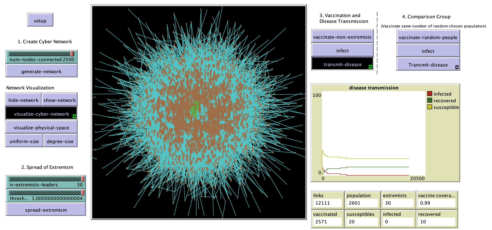

# Cyber-Space-to-Physical-Space Cyber Space to Physical Space Disease Outbreaks 

## Whats Here?

* [The Original Model created using NetLogo (5.3.1)](From_Cyber_Space_Opinion_Leaders_and_the_Diffusion_of_Anti-Vaccine_Extremism_to_Physical_Space_Disease_Out-breaks_NEtLogo_5_3_1.nlogo)
* [An Updated model (NetLogo 6.1.0)](From_Cyber_to_PhysicalSpace_UpdatedModel_NetLogo6_1.nlogo)
* [Overview, Design concepts, and Details (ODD) Document of the Model](ODD.pdf)
* [The Final Paper](Final_Paper_SBP_BRiMS_2017.pdf)

## Abstract

 Measles is one of the leading causes of death among young children. In many developed countries with high measles, mumps, and rubella (MMR) vaccine coverage, measles outbreaks still happen each year. Previous research has demonstrated that what underlies the paradox of high vaccination coverage and measles outbreaks is the ineffectiveness of “herd immunity”, which has the false assumption that people are mixing randomly and there’s equal distribution of vaccinated population. In reality, the unvaccinated population is often clustered instead of not equally distributed. Meanwhile, the Internet has been one of the dominant information sources to gain vaccination knowledge and thus has also been the locus of the “anti-vaccine movement”. In this paper, we propose an agent-based model that explores sentiment diffusion and how this process creates anti-vaccination opinion clusters that leads to larger scale disease outbreaks. The model separates cyber space (where information diffuses) and physical space (where both information diffuses and diseases transmit). The results show that cyber space anti-vaccine opinion leaders have such an influence on anti-vaccine sentiments diffusion in the information network that even if the model starts with the majority of the population being pro-vaccine, the degree of disease outbreaks increases significantly. 

**Keywords**: Agent-based modeling, Information networks, Infectious disease transmission.

## Reference to Paper

**Yuan, X. and Crooks, A.T. (2017)**, From Cyber Space Opinion Leaders and the Spread of Anti-Vaccine Extremism to Physical Space Disease Outbreaks, in Lee, D., Lin, Y., Osgood, N. and Thomson, R. (eds.) *Proceedings of the 2017 International Conference on Social Computing, Behavioral-Cultural Modeling and Prediction and Behavior Representation in Modeling and Simulation*, Springer, New York, NY., pp. 114-119. [(PDF)](https://www.dropbox.com/s/kzzss78ck8pz170/SBP_BRiMS_2017.pdf?dl=0).

## An Example Simulation Run

Click on the image to see an example simualtion run:

